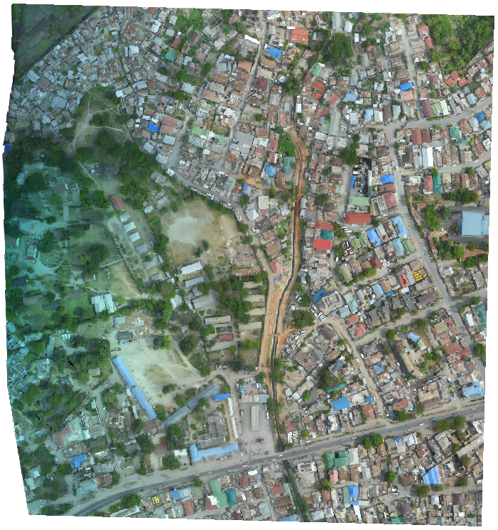
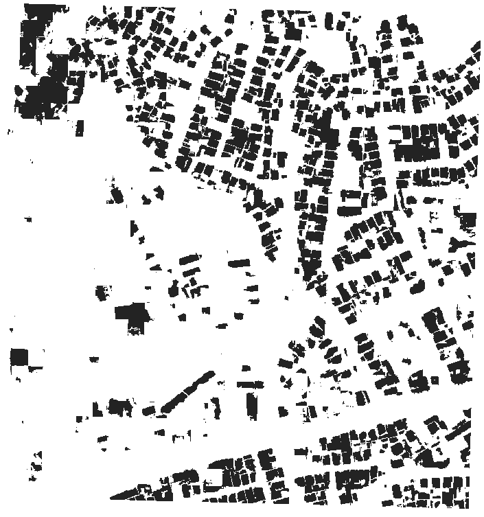

# Open Cities AI Challenge benchmark model
Benchmark model for DrivenData Open Cities AI Challenge

This repository is designed to be a resource for contestants of [DrivenData's Open Cities AI Challenge](https://www.drivendata.org/competitions/60/building-segmentation-disaster-resilience/page/150/). The objective of this challenge is to develop a machine learning model that can segment out buildings from aerial imagery of several African cities. The code and documentation contained here demonstrate how to train a model and make predictions on the competition data using [Raster Vision](https://rastervision.io/).

## Raster Vision
Raster Vision (rv) is an python framework that makes it easy to implement existing backend deep learning frameworks for computer vision tasks that use satellite, aerial and other large format imagery. To learn more about what Raster Vision can do, check out [the docs](https://docs.rastervision.io/en/0.9/) or [this blog post](https://www.azavea.com/blog/2018/10/18/raster-vision-release/) announcing its release. If you are interested in tutorials on using Raster Vision outside the context of this competition, there are several examples in the [raster-vision-examples repo](https://github.com/azavea/raster-vision-examples).

## Instructions

An rv experiment can be run either locally or on [AWS Batch](https://aws.amazon.com/batch/) but to train a deep learning model you will need access to GPUs. This example demonstrates how to train a model on AWS Batch. Using batch is beneficial not only because we gain access to GPUs but it also allows us to split some of the tasks across many instances and speed up the process. If you would like to reproduce this example on AWS Batch, begin by following the configuration instructions within the [Raster Vision AWS repo](https://github.com/azavea/raster-vision-aws).

In this experiment you will train on four different scenes from four different cities in the tier 1 training set and validate on four different scenes from the same four cities within the same training set. The 8 scenes are identified in `benchmark.constants.py`. Training on a larger and more diverse selection of images would likely yield better results but this is meant to serve as introductory example. In this example we will also demonstrate how to use Raster Vision to predict on all of the test imagery and format it to match the submission guidelines. 

### *1. Download test STAC*
PyStac is able to access STAC catalogs on s3 but it is much faster to read them locally. It will not be a problem to read the training STAC directly from the DrivenData hosted s3 bucket but given that there are so many items in the test set (over 11,000), we recommend that you download the STAC and read it locally. It will end up being much faster than trying to read from s3 each time. 

- Download the test data from [the data download page](https://www.drivendata.org/competitions/60/building-segmentation-disaster-resilience/data/) and unpack it into a 'test' directory within the data folder in this repo

### *2. Build and publish docker resources*
This experiment is designed to run within a pre-configured docker environment. You can build, publish and run the docker resources using scripts within the `docker` directory.

Build the docker image:
```
./docker/build
```
This will create a local docker image called 'raster-vision-wb-africa' that includes the code within the `benchmark` module, which you will need to run this experiment. 

If you would like to run the workflow on remotely you will need to publish the image to AWS Batch. 
- Edit `docker/publish_image` to reference the ECR cpu and gpu repos that you created during the [Raster Vision AWS setup](https://github.com/azavea/raster-vision-aws#raster-vision-aws-batch-runner-setup).
Publish your docker image to both gpu and cpu repos:
```
./docker/publish_image
```
Both images will be tagged with `world-bank-challenge`. When/if you make changes to the aux commands you will need to repeat this process (i.e. rebuild the docker image and publish the updated version to ecr).

Run the docker container with the run script:
```
./docker/run --aws
```
The `--aws` flag forwards your AWS credentials which you will need if you plan to run any jobs remotely or access data on s3. However if you store your data and train the model locally you can run the script without it.

In order to run the aux commands necessary for this experiment you will need to [update your Raster Vision configuration](https://docs.rastervision.io/en/latest/setup.html#aws-batch-configuration-section). Add the following lines to the bottom of the configuration file for the profile you plan to use:
```
[PLUGINS]
modules=benchmark.aux
```
or use the template in `.rastervision/wbbenchmark`.

### *3. Preprocess training imagery*
Many of the training scenes are too large to read into memory in order to produce training chips. Of course this would depend on the amount of memory you are able to allocate but this is experiment is set up to work on remote cpu instances with 6gb of memory each. To get around this issue, you need to split the original images up into smaller images (or image splits) that are a manageable size. We can do this using an [RV Aux Command](https://docs.rastervision.io/en/0.10/commands.html#auxiliary-aux-commands) that you can write to perform and data processing operation in a sequence with the stand rv commands (e.g. `train`, `predict`, `eval`). The `PREPROCESS` aux command is defined in the `aux` submodule. 

From within the docker container, first define the root uri and image split location:
```
export ROOT_URI=[insert project root_uri]
```
The root uri is the directory where all output will be written to. If you are running this experiment remotely is should be an s3 folder. If you are running the experiment locally, the root_uri must be within the docker container. By default, the image splits will be written to a directory within root called `split_images`.

Then run the preprocessing experiment:
```
rastervision -p wbbenchmark run aws_batch -e benchmark.experiments.split_images \
    PREPROCESS -a root_uri $ROOT_URI -s 8
```
In this command, `-s 8` specifies the number of splits to use for this command. This means that you will employ 8 different cpu instances to make the job run faster. This is the maximum number of splits that we can use for this step because we are splitting across the 8 training/validation scenes.

Alternatively you can opt to update the `ROOT_URI` in `wb_scripts/preprocess` and simply run that script.

### *4. Train the benchmark model and make predictions*
The model training and prediction configuration is located in `benchmark/experiments/benchmark.py`. That script includes detailed annotation so refer to the comments for a detailed explanation of the script. You can run the experiment using the `benchmark` script:
```
./wb_scripts/benchmark
```
but first you need to update some parameters within the script
```
export ROOT_URI=[experiment root uri]
export EXPERIMENT_ID=[give your experiment an ID]
export TEST_STAC_URI=/opt/data/test/catalog.json
export TRAIN_STAC_URI=s3://drivendata-competition-building-segmentation/train_tier_1/catalog.json
export TEST_IMG_DIR=s3://drivendata-competition-building-segmentation/test/
```
The `ROOT_URI` parameter is the directory that you specified in the previous step. You also need to provide an `EXPERIMENT_ID` which is string that identifies the experiment. The experiment id will be used to specify the locations of the output from each command (i.e. predictions can be found in `<root_uri>/predict/<experiment_id>/`). This script also assumes that you have downloaded the test STAC (step 1) and are reading train metadata, train imagery, and test imagery directly from s3.

Run the benchmark model experiment:
```
rastervision -p wbbenchmark run aws_batch -e benchmark.experiments.benchmark \
    chip train predict eval bundle POSTPROCESS \
    -a experiment_id $EXPERIMENT_ID \
    -a root_uri $ROOT_URI \
    -a train_stac_uri $TRAIN_STAC_URI \
    -a test_stac_uri $TEST_STAC_URI \
    -a test_img_dir $TEST_IMG_DIR \
    -x -r -s 10
```
This will submit a series of jobs to AWS Batch and print out a summary of each job complete with an outline of which task must complete before the job in question can start. If you would like to first do a 'dry run' (i.e. see the aforementioned output without actually submitting any jobs), add `-n` to the end of the command. Use the 'test' flag (`-a test True`) to run am experiment on a small subset of the data and with very short training times. This may be helpful to make sure everything is configured correctly before trying to run the full experiment.

### *5. Evaluate model performance and submit results*
The training stage should take roughly 14 hours running on batch. Once training is done, prediction, postprocessing and evaluation will complete shortly after. You can see how the model performed on the validation set by looking at the output of eval (`<root_uri>/eval/<experiment_id>/eval.json`). You can also view predictions (`<root_uri>/predict/<experiment_id>/<scene id>.tif`) and compare to the original images:

Image             |  Predictions
:-------------------------:|:-------------------------:
  |  

The test set predictions will be in the `postprocess` folder within the root directory. To submit them for the competition simply download all of the images into a local directory and compress them:
```
tar -cvzf submission.tgz *
```
This will result in a `submission.tgz` file that you can upload via the [competition submission page](https://www.drivendata.org/competitions/60/building-segmentation-disaster-resilience/submissions/).